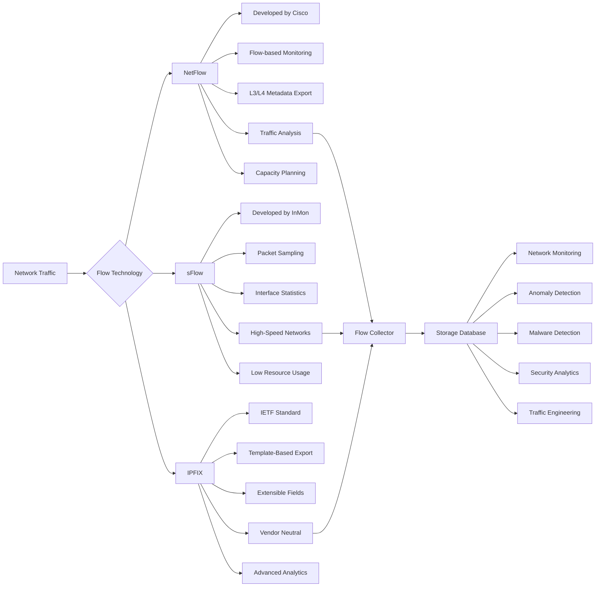
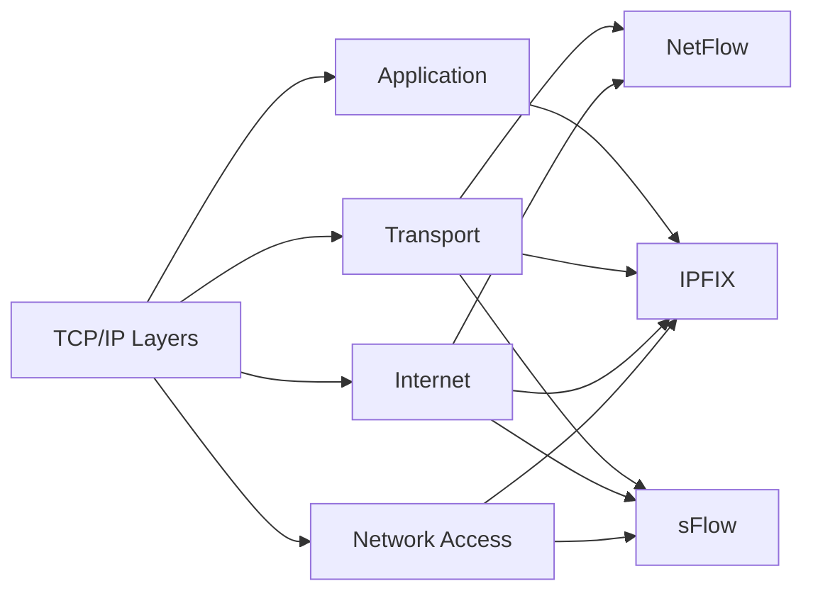

<div align="center">



# **`Flow Toolkit`** | Network Traffic [Flow](https://wikipedia.org/wiki/Traffic_flow_(computer_networking)) Toolkit
</div>

[](https://youtube.com/playlist?list=PL9V4Zu3RroiWqr2YTIFniPf5GDp6WteEV&si=CiOTgkl-RWMihxkb)
[]()

<p align="center">
    <a href="https://github.com/cybersecurity-dev/"></a>
    &nbsp;
    <a href="https://www.youtube.com/@CyberThreatDefense"></a>
    &nbsp;
    <a href="https://cyberthreatdefence.com/my_awesome_lists"></a>
    
</p>


## 📖 Contents
- [Flow Types](#flow-types)
- [NetFlow](#netflow)
- [sFlow](#sflow)
- [IPFIX](#ipfix)
- [Flow Generator and Analyzer](#flow-generator-and-analyzer)
- [My Awesome Lists](#my-awesome-lists)
- [Contributing](#contributing)
- [Contributors](#contributors)


## Flow Types

```text
                TCP/IP MODEL

        ┌─────────────────────────────┐
        │ Application                 │
        │ HTTP HTTPS DNS SMTP SSH     │◄── IPFIX
        ├─────────────────────────────┤
        │ Transport                   │
        │ TCP UDP SCTP                │◄── NetFlow
        │                             │◄── sFlow
        │                             │◄── IPFIX
        ├─────────────────────────────┤
        │ Internet                    │
        │ IPv4 IPv6 ICMP              │◄── NetFlow
        │                             │◄── sFlow
        │                             │◄── IPFIX
        ├─────────────────────────────┤
        │ Network Access              │
        │ Ethernet VLAN ARP Wi-Fi     │◄── sFlow
        │                             │◄── IPFIX
        └─────────────────────────────┘
```

```text
Technology    Application   Transport   Internet   Network Access

NetFlow            ✗            ✓           ✓            ✗

sFlow              ✗            ✓           ✓            ✓

IPFIX              ✓            ✓           ✓            ✓
```

### [NetFlow](https://wikipedia.org/wiki/NetFlow)
> Who talks to whom? (IP + Ports)
```txt
NetFlow
└── Transport + Internet
    (TCP/UDP + IP)
```

### [sFlow](https://wikipedia.org/wiki/SFlow)
> What is happening on the wire? (Sampled packets + Interfaces)
```txt
sFlow
└── Network Access + Internet + Transport
    (Ethernet + IP + TCP/UDP)
```

### [IPFIX](https://wikipedia.org/wiki/IP_Flow_Information_Export)
> Who talks, how, using what application, and what metadata is available?
```txt
IPFIX
└── All TCP/IP Layers
    (Application + Transport + Internet + Network Access)
```



## Flow Generator and Analyzer

| Tool | Primary role | Input | Output | Best use case | Key advantage | Main consideration |
|---|---|---|---|---|---|---|
| **YAF** | Flow meter and exporter | Live interface, PCAP | IPFIX, IPFIX-based files | Reference baseline for packet-to-flow conversion | Bidirectional IPFIX flow generation and integration with SiLK | Output may require additional conversion for ML pipelines |
| **nProbe** | Flow probe, collector and traffic enricher | Live traffic, PCAP, NetFlow, IPFIX, sFlow | NetFlow, IPFIX, JSON | Application-aware monitoring and DPI | Layer 7 application identification through nDPI | Some advanced functionality may require a commercial licence |
| **CICFlowMeter** | Bidirectional statistical flow generator | PCAP, live interface | CSV | ML/DL intrusion and malware-detection datasets | Produces more than 80 directional and statistical features | Feature definitions, timeouts and duplicated columns require validation |


* [YAF (Yet Another Flowmeter)](https://tools.netsa.cert.org/yaf2/index.html)
##

### My Awesome Lists
You can access the my awesome lists [here](https://cyberthreatdefence.com/my_awesome_lists)

### Contributing
[Contributions of any kind welcome, just follow the guidelines](contributing.md)!

### Contributors
[Thanks goes to these contributors](https://github.com/cybersecurity-dev/NetFlow-Toolkit/graphs/contributors)!

[🔼 Back to top](#flow-toolkit--network-traffic-flow-toolkit)
